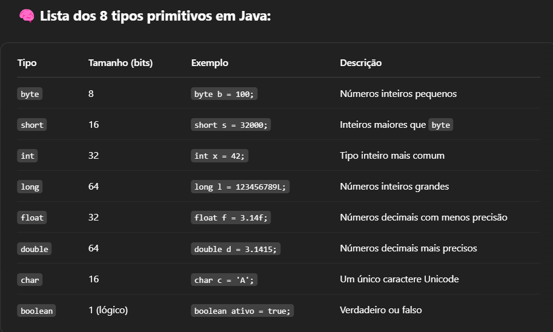
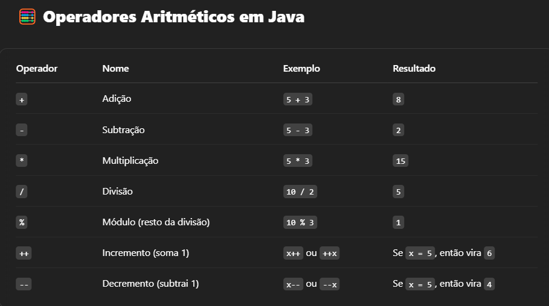
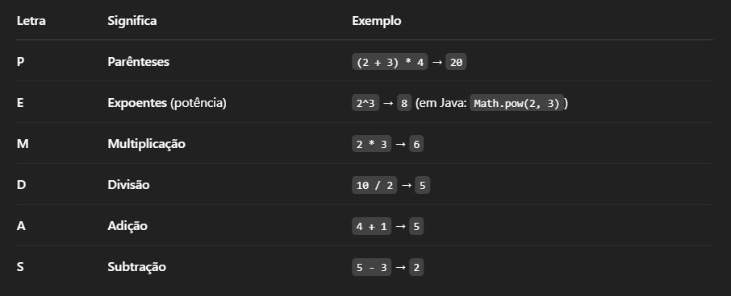

[🔙 Voltar ao menu](../../README-pt_BR.md)

# 📘 PRÉ-OOP - Java ☕

---

## 📌 Tópicos abordados

- 📥 Entrada e saída de dados
- ✏️ Declaração de variáveis
- 🔢 Tipos primitivos
- ➕ Operadores aritméticos
 - 💡 Precedência de operadores
- 🔄 Casting (conversão de tipos)
- 🔃 Ordem lógica da execução
- 🧵 Concatenação de strings

---

## 📥 Entrada e saída de dados

Para começarmos a entender mais sobre Java, primeiro devemos fazer o clássico: escrever "Hello world".

```java
public class Main {
    public static void main(String[] args) {
        System.out.println("Hello world");
    }
}
```

### Comandos de saída de dados

- `System.out.println();`  
  Imprime e quebra linha. Também pode ser usado para quebrar linha sozinha:

```java
System.out.print("Hello world");
System.out.println();
System.out.print("Hello world");
```

- `System.out.print();`  
  Apenas imprime, sem quebra de linha:

```java
System.out.print("Hello world");
System.out.print("Hello world");
```

- `System.out.printf();`  
  Imprime com possibilidade de formatação. Exemplos:

```java
int num = 25;
double pi = 3.14159265359;
String name = "Java Dev";
char ch = 'a';

System.out.printf("Inteiro: %d\n", num);
System.out.printf("Ponto flutuante: %f\n", pi);
System.out.printf("String: %s\n", name);
System.out.printf("Caractere: %c\n", ch);
System.out.printf("Largura: |%5d|\n", num);
System.out.printf("Precisão float: %.2f\n", pi);
System.out.printf("Precisão String: %.3s\n", name);
System.out.printf("Largura e precisão: |%5.2f|\n", pi);
System.out.printf("Sinal: %+d\n", num);
System.out.printf("Alinhado à esquerda: |%-5d|\n", num);
System.out.printf("Preenchido com 0: |%05d|\n", num);
System.out.printf("Pi: %.2f, num: %d, nome: %s", pi, num, name);
```

---

## ✏️ Declaração de variáveis

Declarar variáveis em Java é simples, mas devemos seguir uma ordem lógica:

```java
int num = 10;
String nome = "Java";
boolean x = true;
float f = 3.23f; // "f" é obrigatório para float
```

---

## 🔢 Tipos de dados primitivos

  
*Tabela com os principais tipos primitivos e seus tamanhos em bits*

---

## ➕ Operadores aritméticos

  
*Tabela com os principais operadores aritméticos*

Devemos respeitar a ordem de precedência ao realizar operações matemáticas:

```java
int a = 10 + 10 / 10;
System.out.print(a); // Resultado: 11
```

Por quê? Por causa da ordem de precedência (PEMDAS):



Para forçar outra ordem:

```java
int a = (10 + 10) / 10;
System.out.print(a); // Resultado: 2
```

---

## 🔄 Casting (conversão de tipos)

Casting é a conversão direta de tipos:

```java
float valorFloat = 2032f;
int valorInt = (int) valorFloat; // Conversão direta

System.out.println("Valor original: " + valorFloat);
System.out.println("Valor convertido: " + valorInt);
```

---

## 🔃 Ordem lógica da execução

Os comandos são executados na ordem em que aparecem:

```java
int num = 10;
num = 20;
System.out.print(num); // Imprime 20
```

---

## 🧵 Concatenação de Strings

Concatenar é juntar Strings para formar uma nova:

### 1 Operador `+`

```java
String a = "Olá, ";
String b = a + "mundo";
String name = "Estou aprendendo Java";
String name2 = " e fazendo um portfólio";

System.out.println(name + name2);
System.out.print(b);
```

### 2 Método `concat()`

```java
String name = "Estou aprendendo Java";
String name2 = " e fazendo um portfólio";
String c = name.concat(name2);
System.out.print(c);
```

### 3 `StringBuilder`

```java
StringBuilder sb = new StringBuilder();
sb.append("Olá!, ");
sb.append("me chamo Leonardo.");
sb.append(" Tenho ");
sb.append(19);
sb.append(" anos");

String result = sb.toString();
System.out.println(result);
```

### 4 `String.format()`

```java
String name = "Java";
int version = 17;
String resultado = String.format("Eu estudo %s na versão %d LTS", name, version);
System.out.print(resultado);
```
---

