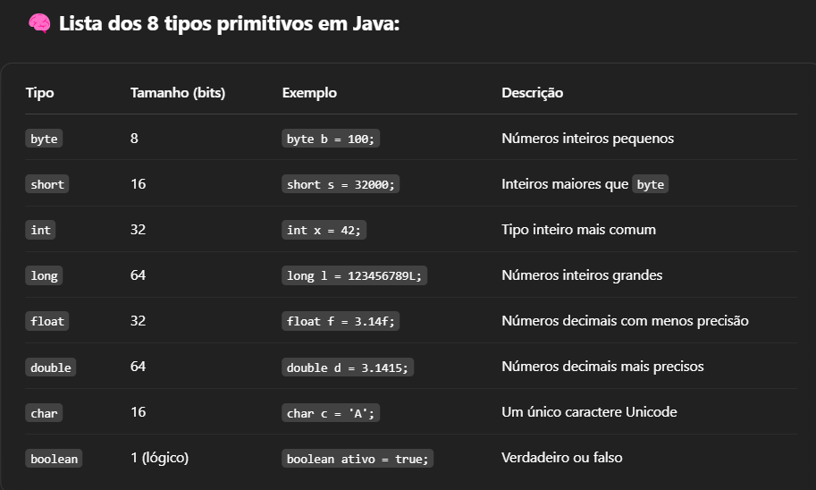
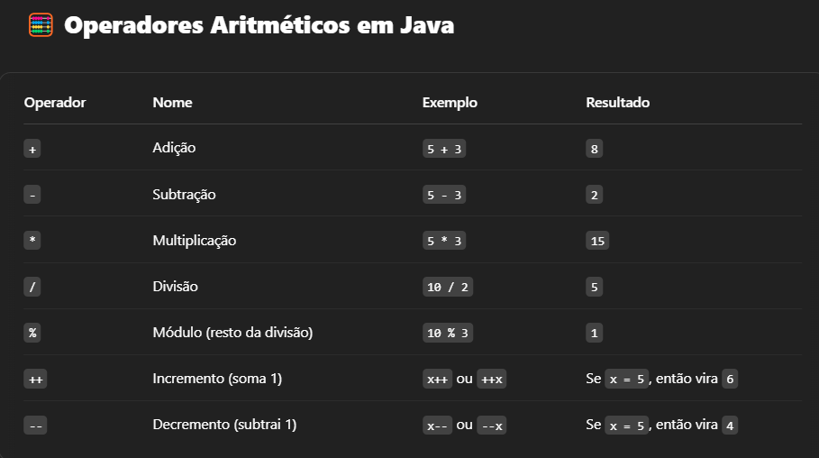
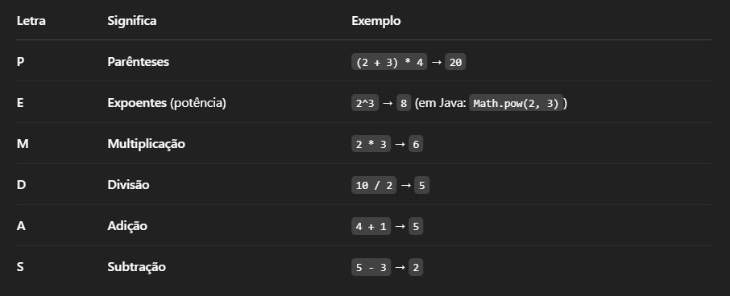

< [Voltar ao menu](../../../../README-pt_BR.md)
# PRÉ OOP - Java ☕︎

--- 
## 📌 Tópicos abordados
- Estrutura sequencial
- - 📌 Entrada e saída de dados
- - ✏️ Declaração de variáveis
- - 🔢 Tipos de dados primitivos
- - 🧮 Operadores aritméticos
- - - 💡 Precedência de operadores
- - 🧠 Casting (conversão de tipos)
- - 📏 Ordem lógica da execução
- - 🧾 Concatenação de strings
- - 🧊 Constantes (final em Java)
- - [📐 Exercícios]()
---

## Entrada e saída de dados
- - Para começarmos a entender mais sobre Java, primeiro devemos fazer o rito de qualquer linguagem, escrever
 "Hello world". 
```java
public class Main {
    public static void main (String[] args){
        System.out.println("Hello world");
    }
}
```
- - -
### Para exibirmos dados no console, normalmente usaremos 3 comandos:
- - `System.out.println();` "ln" significa "line", do inglês "linha". Isto é, **imprime e quebra linha**. 
 Perfeito para exibir dados simples, sem formatação. Também pode ser usado apenas para quebrar a linha. Ex:
 ```java
public class Main {
    public static void main (String[] args){
        System.out.print("Hello world");
        System.out.println();
        System.out.print("Hello world");
    }
}
```
- - `System.out.print();` Apenas imprime. Não possui quebra de linha. Os dois "Hello world" sairão na mesma linha.
```java
public class Main {
    public static void main (String[] args){
        System.out.print("Hello world");
        System.out.print("Hello world");
    }
}
```
- - `System.out.prinf();` Imprime e possui possibilidade de formatação. Usado para formatar a saída. Existem vários
 especificadores de formatos.

```java
public class Main {
    public static void main (String[] args){ // Vamos nos focar apenas nas saídas de dados.
        int num = 25;
        double pi = 3.14159265359;
        String name = "Java Dev";
        char ch = 'a';

        System.out.printf("Inteiro: %d\n",num); // "\n é usado para quebrar linhas em Java.
        System.out.printf("Ponto flutuante: %f\n",pi);
        System.out.printf("String: %s\n",name);
        System.out.printf("Único caráctere: %c\n",ch);
        System.out.printf("Largura :|%5d|\n",num); // Podemos definir largura mínima das variáveis. 
        System.out.printf("Precisão (Números) :%.2f\n",pi); //Se o valor for menor, ele ser preenchido por espaços (por padrão)
        System.out.printf("Precisão (Strings) :%.3s\n",name);
        System.out.printf("Largura e precisão :|%5.2f|\n",pi);
        System.out.printf("Sinal : %+d\n",num); //+ logo após %, define o sinal
        System.out.printf("Alinha à esquerda : |%-5d|\n",num);
        System.out.printf("Preenche com 0´s à esquerda : |%05d|\n",num);
        System.out.printf("Pi: %.2f, num: %d, name: %s",pi,num,name); // Formatação de múltiplos valores.
    }
}
```
- - Existem mais alguns especificadores de formatos, mas estes são os principais.
- - -
## Declaração de variáveis
- Declaração de variáveis é algo básico e muito simples. Temos apenas que nos atentar em
 seguir uma sequência.
```java
public class Main
{
 public static void main(String[] args) {
  int num = 10;
  String nome = "Java"; // Tipo nome = valor
  boolean x = true;
  float f = 3.23f; // Obrigatório usar f após número
 }
 
}
```
- - -
## Tipos de dados primitivos

- - -
## Operadores aritméticos

- - Assim como na matemática usual, devemos seguir a precedência dos operados para realizar uma conta aritmética.
```java
public class Main
{
	public static void main(String[] args) {
		
		int a = 10 + 10 / 10; 

		System.out.print(a);
	}
}
```
- - Tente resolver mentalmente. Se você pensou que a resposta seria 2. Está errado. O resultado é 11.
 Mas, por quê? Ora, existe a precedência de operadores. Uma regra que resume bem é PEMDAS, vejamos:

- Então, para a conta ter como resultado 2, o modo correto seria:
```java
public class Main
{
	public static void main(String[] args) {
		
		int a = (10 + 10) / 10; 

		System.out.print(a);
	}
}
```
- - -
## Casting (conversão de tipos)
- Casting, também conhecido como conversão direta, é uma forma de alterar diretamente o valor de um tipo de dado para outro.
- Vamos imaginar um cenário em que estarei operando com tipo `float`, mas não quero usar `printf()`. Então,
 uso casting para mudar ao tipo inteiro.
```java
public class Main
{
	public static void main(String[] args) {
		
		float valorFloat = 2032f; 
        int valorInt = (int) valorFloat;
        
        // Fiz uma conversão direta
		System.out.println("Valor Anterior: "+ valorFloat);
		System.out.println("Valor Atualizado: "+ valorInt);
	}
}
```
- - -
## Ordem lógica da execução
- Comandos obedecem uma ordem sequencial. Ou seja, de forma ordenada. Cada linha de comando é executada na ordem que foi 
 inserida. Isso também deve atentar-nos ao fato de que variáveis também podem mudar de valor. A não ser, que seja declarada
 como `final`.
```java
public class Main{
    public static void main (String[] args){
        
        int num = 10;
        num = 20;
        System.out.print(num); // Não irá mais imprimir 10, mas sim 20.
    }
}
```
- - -
## Concatenação de Strings
- Em Java, concatenação de Strings é juntarmos uma String a outra e assim gerarmos uma nova String. Ex:
```java
public class Main{
    public static void main (String[] args){
        
        
        String name = "Estou aprendendo Java";
        String name2 = " e fazendo um portifólio";
     
        System.out.println(name+name2);
    }
    
}
```
- Esta é uma das formas mais simples de concatenarmos Strings em Java


